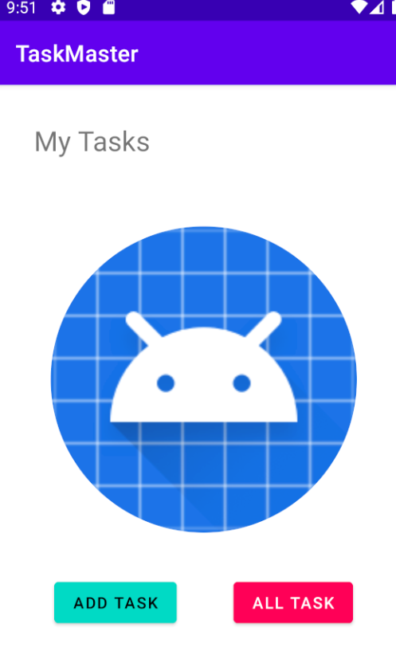
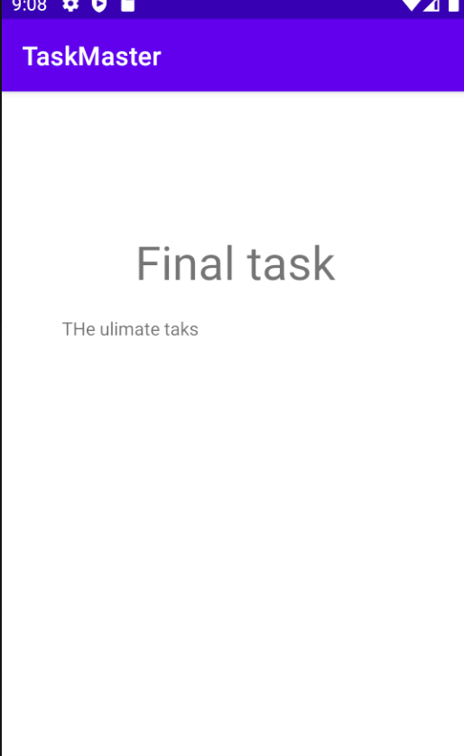
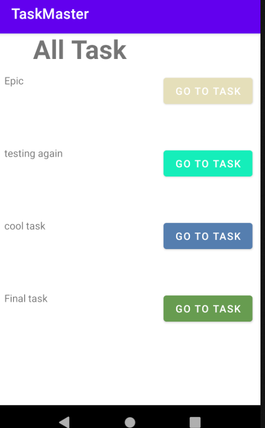

# TaskMaster
Keep track of your task!

## Author: Cristian Robles

## Version 2.0.0

## Change Log
2.0.0- Using new dynodb! Now you can add taks to the database and get them anywhere else!

1.2.0- Added testing for UI with expresso, every functionality working as intended.

1.1.0- Overhauled some Ui changes, now functional add task with a working database. New recycler ui elements with different fragments being used depending on the chosen number. User can now view the task by clicking on the button to be taken to the task details activity.

1.0.1- Added settings and task details with additional buttons.

1.0.0- Initial app made with activities for all task and add task

