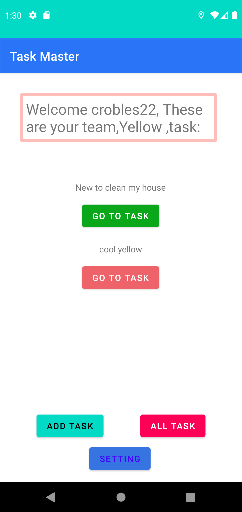

# TaskMaster
Keep track of your task!
An android app allowing you to add task from your everyday life.

## Author: Cristian Robles

## Version 2.1.0

## Change Log

2.1.0- Added ability to now upload images when adding new task. Users at the moment must be signed in
 or else not allow them to add a task at all. To view others image on task you must be signed in as well.

2.0.5- Added new feature for users to able to sign up and sign in on their account, Implemented Auth plugin.
Users are able to logout out as well, with dynamic UI.

2.0.1- Updating dynamoDb schema and models, Refactor code to use new entities and allow user to change the team they are in to see different task belonging to each team!

2.0.0- Using new dynamodb! Now you can add taks to the database and get them anywhere else!

1.2.0- Added testing for UI with expresso, every functionality working as intended.

1.1.0- Overhauled some Ui changes, now functional add task with a working database. New recycler ui elements with different fragments being used depending on the chosen number. User can now view the task by clicking on the button to be taken to the task details activity.

1.0.1- Added settings and task details with additional buttons.

1.0.0- Initial app made with activities for all task and add task

